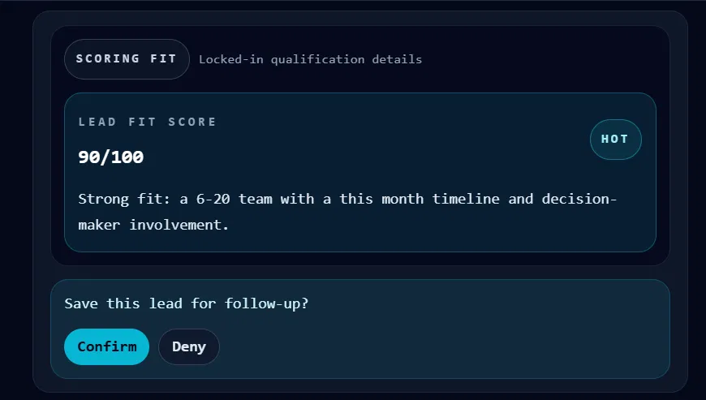
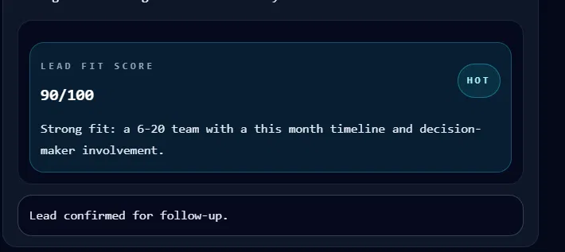
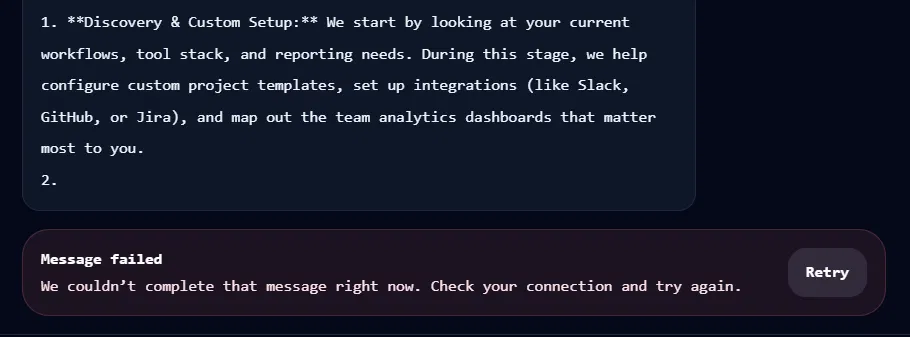
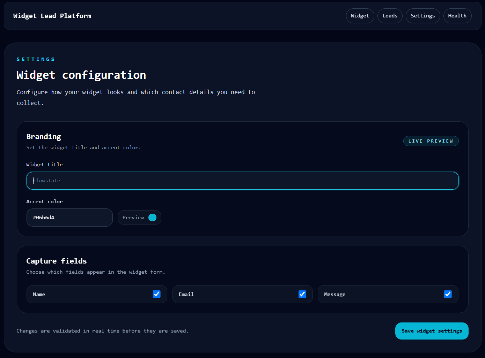

# Lead Generation Widget

Front-end AI Engineering track assignment. A lead capture widget app built with Next.js,
using Firebase/Firestore for data storage, developed with AI-assisted tooling (GitHub Copilot).

**Live preview:** [LeadGenWidget](https://lead-geneapp.vercel.app/)

## About

This repo documents both the built application and the AI-assisted development workflow
used to build it, including prompts used, manual corrections made to AI-generated code,
and architectural decisions.

## Stack

- Framework: Next.js (App Router)
- Language: TypeScript
- Styling: Tailwind CSS
- Package manager: npm
- Backend: Firebase (Firestore + Admin SDK for server-side reads)

## Screens

- `/` - Home
- `/widget` - Lead capture form
- `/leads` - Leads dashboard
- `/leads/[id]` - Lead detail
- `/settings` - Widget configuration
- `/health` - Health check (live Firestore read via server-only Admin SDK)

See `SPEC.md` for the full spec and `claude.md` for project conventions.

## Screenshots

**Qualification chat with a live score card**


**Human-in-the-loop confirmation before saving a lead**


**Designed error state with retry, mid-stream failure**


**Widget settings form with validation**


*(Add these four image files to `docs/screenshots/` in the repo.)*

## Run locally

```bash
git clone https://github.com/P-Henrique2/Lead-Generation-Widget.git
cd Lead-Generation-Widget
npm install
cp .env.example .env.local
npm run dev
```

Open `http://localhost:3000`.

To run the test suite:
```bash
npm run test          # component/unit tests (Vitest)
npx playwright test   # end-to-end test (requires a real API key)
```

## Environment variables

| Variable | Required | Description |
|---|---|---|
| `GOOGLE_GENERATIVE_AI_API_KEY` | Yes | Gemini API key from [aistudio.google.com](https://aistudio.google.com). Free-tier quota (20 requests/day) appears pooled per Google account, not per key or project. |
| `FIREBASE_PROJECT_ID` | Yes | Firebase project ID, from your Firebase project settings. |
| `FIREBASE_CLIENT_EMAIL` | Yes | Service account client email, from a Firebase Admin SDK service account key. |
| `FIREBASE_PRIVATE_KEY` | Yes | Service account private key. Keep the `\n` escape sequences as-is in `.env.local`. |
| `RATE_LIMIT_MAX` | No | Max requests per IP per window. Defaults to 10. |
| `RATE_LIMIT_WINDOW_MS` | No | Rate-limit window in milliseconds. Defaults to 600000 (10 min). |

## Architecture

- **Framework:** Next.js 14 (App Router), TypeScript, Tailwind CSS
- **AI:** Vercel AI SDK's `streamText`, Google Gemini (`gemini-3.6-flash`), streamed to the
  client via `useChat`
- **Tools:** the model calls two server-side tools mid-conversation, `scoreLead` and
  `saveLead` (documented below)
- **Data:** Firebase Firestore, read/written only through the server-only Admin SDK, no
  client-side Firebase access
- **Resilience:** route-level `error.tsx` boundaries, a `useChat`-based retry action that
  resends only the failed message (not the whole conversation), and IP-based rate limiting
  to prevent quota exhaustion from public traffic
- **Testing:** Vitest + React Testing Library for component tests (chat renderer across all
  tool states, the settings form, the score card), one Playwright end-to-end test, CI via
  GitHub Actions on every push

## AI Tools

### scoreLead

**Purpose:** Scores lead fit during the qualification chat and persists the result to Firestore.

**Input schema:**
- `teamSize`: `"1-5"` | `"6-20"` | `"21-50"` | `"50+"`
- `timeline`: `"this month"` | `"this quarter"` | `"exploring"`
- `isDecisionMaker`: `boolean`

**Returns:**
```ts
{
  score: number;      // 0-100
  tier: "hot" | "warm" | "cold";
  reasoning: string;
}
```

**Side effect:** writes the scored lead to the `leads` Firestore collection. If this write fails, the tool throws, surfacing as the `output-error` state in the chat UI.

**To trigger the error state for review:** temporarily add `throw new Error(...)` as the first line of `execute()` in `route.ts`, or break the Firestore write path.

### saveLead

**Purpose:** Human-in-the-loop confirmation before a scored lead is saved for follow-up. No server `execute` function, the model proposes the save, and the client renders Confirm/Deny controls that call `addToolResult` to supply the outcome.

**Input schema:**
- `reason`: `string` (optional), why the assistant is proposing to save this lead

**Returns:**
```ts
{
  confirmed: boolean;
}
```

## Notes on Gemini free-tier quota

The `generate_content_free_tier_requests` quota (20 requests/day) appears to be pooled at the Google account level, not per API key or per project. Creating a new API key under the same account does not reset it, only a different account, or waiting for the daily reset, does.

## Key decisions

- **Next.js + Vercel over a CMS-backed or no-code alternative** - evaluated three options
  (plain HTML/GitHub Pages, Next.js + Vercel, Next.js + a headless CMS) against real
  constraints: free hosting, existing skill level, and what the site actually needed to
  display. Next.js won because the stack was already known (lower maintenance risk) and the
  CMS option solved a content-update problem the project didn't actually have yet.
- **In-memory rate limiting instead of a paid service** -  sufficient deterrent at this
  project's scale; documented in code that it resets on serverless cold starts and isn't
  perfectly consistent across instances, an accepted tradeoff for a free-tier demo.
- **Gemini over Claude/OpenAI** - chosen for its free tier, the range of available models, and prior familiarity with the Gemini API from previous work.

## How AI tools built this

This project was built primarily with GitHub Copilot, directed through structured prompts
rather than one-shot requests. Some concrete examples of where AI output needed correction,
not just acceptance:

- **A vague-vs-precise prompting drill** - produced two working-but-different settings forms
  from the same feature request: the vague prompt ("build the settings form") produced a
  form with zero validation and an accent-color field limited to four preset swatches
  instead of arbitrary hex input. The precise prompt, with file references, explicit
  validation constraints, and a required test-writing step, produced a `react-hook-form` +
  `zod` implementation with a cross-field rule (at least one capture toggle must stay
  enabled) that the vague prompt never considered, because it requires reasoning about
  fields as a set rather than individually.
- **A real bug that passed tests but failed the production build:** a `useRef` callback
  assignment typed in a way that satisfied Vitest's looser JSX/type handling but failed
  Next.js's stricter production type-checker with "Cannot assign to 'current' because it is
  a read-only property." This is the concrete reason `npm run build` and `npm run test` are
  both run in CI, not just one.
- **A tooling conflict that took several iterations to actually fix, not paper over:**
  Next.js requires `tsconfig.json`'s `jsx` field to stay `"preserve"` and silently rewrites
  it back if changed; Vitest's JSX parser requires `"react-jsx"` and fails otherwise. Fixing
  one broke the other twice before landing on the real fix, adding `@vitejs/plugin-react`
  to `vitest.config.ts` so Vitest handles its own JSX transform independently of the
  Next.js-owned `tsconfig.json`.
- **A generated Copilot plan referenced a file that didn't exist yet**, stated as
  present-tense fact rather than a proposal, caught by checking the actual repo state
  before approving the plan, not by trusting the summary.
- **A deterministic mid-stream failure test** was needed because real network throttling in
  DevTools wasn't reliable, responses completed faster than manual reaction time allowed,
  so an env-flag-gated forced failure was added to reliably verify the error-and-retry UI,
  then removed before shipping.

## Known gaps, stated honestly

- Mobile Safari and desktop Safari were not tested, no Apple device available. Tested
  instead on real Android (Chrome) and desktop Firefox + Chromium-based browsers.
- Screen-reader announcement of streamed text (`aria-live="polite"`) was verified by code
  inspection, not a live screen-reader session (VoiceOver/NVDA).